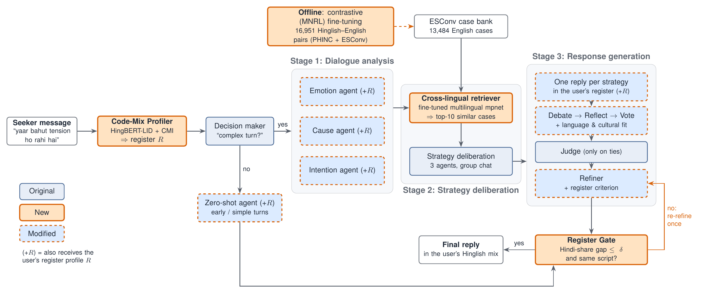

# CodeMixESC

[](https://github.com/roshanraj9136/CodeMixESC/actions/workflows/tests.yml)

**Multi-agent emotional support conversation for code-mixed Hinglish help-seekers, with
cross-lingual experience retrieval and register-aware response selection.**

Roshan Raj, IIT Bhilai — course project. Base paper: *MultiAgentESC: A LLM-based Multi-Agent
Collaboration Framework for Emotional Support Conversation* (Xu et al., EMNLP 2025),
[code](https://github.com/MindIntLab-HFUT/MultiAgentESC).

Many help-seekers in India describe distress in Roman-script Hindi–English
("yaar result aaya, bahut tension ho rahi hai, ghar pe kaise bataun"). MultiAgentESC retrieves
its "experience" with an English-only encoder, selects and refines responses without regard to
the user's language register, and was evaluated on English only. CodeMixESC keeps its
three-stage multi-agent pipeline and adds four components, without fine-tuning the LLM agents:

1. **Code-Mix Profiler** — HingBERT-LID word tags and the Code-Mixing Index give the seeker's
   register profile R = (CMI, dominant language, script), shown to every later agent.
2. **Cross-lingual experience retrieval** — `paraphrase-multilingual-mpnet-base-v2` fine-tuned
   with a contrastive (Multiple Negatives Ranking) loss on Hinglish–English pairs (PHINC +
   Hinglish rewrites of ESConv training utterances), so Hinglish queries retrieve the English
   ESConv case bank without translating it.
3. **Register-aware generation and selection** — the generator answers in the seeker's script
   and Hindi–English mix; debate, voting and the refiner add a *language and cultural fit*
   criterion.
4. **Register Gate** — if the reply's Hindi share is more than δ away from the seeker's (or the
   script differs), one more refinement with an explicit register instruction (at most one
   extra LLM call per turn; the rewrite is kept only if it is closer to the seeker's register).



## Status and first results

| Part | Status |
|---|---|
| Pipeline (profiler, cross-lingual retriever, register-aware agents, Register Gate, baselines) | done, 110 unit tests, CI |
| ESConv-HiEn development set (12 conversations × Light/Heavy) | done: Light 85% of utterances in the target CMI band (mean CMI 0.17), Heavy 83% (mean CMI 0.37) |
| Cross-lingual retriever (MNRL, 16,951 Hinglish–English pairs, best checkpoint by dev retrieval) | done |
| ESConv-HiEn test set (100 conversations × Light/Heavy) | Light 98/100, Heavy 70/100 (generation limited by the free-tier daily quota) |
| Experiments (agents: `gemma-4-31b-it`, multi-agent systems on a fixed 100-turn sample) | running |

**Retrieval robustness on the development set** (151 turns per version, k = 10, 95%
cluster-bootstrap CI; full table in [`results/tables/retrieval_dev.md`](results/tables/retrieval_dev.md)).
*Overlap@10* = share of the cases retrieved for a Hinglish post that are also retrieved for its
English original by the same encoder; *P@10* = share of retrieved cases with the query's problem
type.

| Encoder | Overlap@10 Light | Overlap@10 Heavy | P@10 Light | P@10 Heavy |
|---|---|---|---|---|
| all-roberta-large-v1 (MultiAgentESC) | 56.0 ± 7.2 | 22.1 ± 7.3 | **30.7** ± 8.6 | **29.6** ± 7.6 |
| LaBSE | 59.7 ± 6.7 | 32.4 ± 6.8 | 25.6 ± 5.7 | 24.9 ± 5.4 |
| multilingual mpnet | 69.9 ± 7.6 | 29.6 ± 7.6 | 29.1 ± 7.7 | 26.7 ± 6.9 |
| **multilingual mpnet, fine-tuned (ours)** | **72.9** ± 5.0 | **54.0** ± 4.4 | 26.7 ± 6.6 | 28.5 ± 6.6 |

Heavy code-mixing breaks the English retriever (only 22% of its cases survive); the fine-tuned
encoder keeps 54% (+31.9 points, CI [+26.0, +37.4]) and makes the strategies of the retrieved
cases the most stable across languages, at the cost of a small, partly significant drop in
problem-type precision. Response-level results will be added here as the runs finish.

```mermaid
flowchart LR
    S[Seeker message<br/>Roman Hinglish] --> P[Code-Mix Profiler<br/>HingBERT-LID + CMI → R]:::new
    P --> D{Decision maker}
    D -- early / not complex --> Z[Zero-shot agent<br/>+ R]:::mod
    D -- complex --> A[Emotion → Cause → Intention<br/>agents + R]:::mod
    A --> X[Cross-lingual retriever<br/>fine-tuned mSBERT, top-10]:::new
    X --> G[Strategy deliberation<br/>3-agent group chat]
    G --> GEN[Response per strategy<br/>conditioned on R]:::mod
    GEN --> V[Debate → Reflect → Vote<br/>+ language fit]:::mod
    V --> J[Judge on ties]
    J --> RF[Refiner<br/>+ register criterion]:::mod
    V --> RF
    RF --> RG{Register Gate<br/>CMI gap ≤ δ, same script?}:::new
    Z --> RG
    RG -- yes --> OUT[Final response]
    RG -- no: re-refine once --> OUT
    classDef new fill:#fde3c8,stroke:#e8710a,stroke-dasharray: 4 3
    classDef mod fill:#dbe8fb,stroke:#e8710a,stroke-dasharray: 4 3
```



## Evaluation
- **ESConv-HiEn** (new): the 100 ESConv test conversations of the base paper rewritten turn by
  turn into Roman-script Hinglish at two mixing levels, *Light* (CMI 0.1–0.3) and *Heavy*
  (CMI 0.3–0.5), with strategy labels copied, CMI-verified per utterance and quality-checked.
  English and Hinglish versions are parallel, so any change in behaviour is due to code-mixing.
- **Systems**: zero-shot and few-shot CoT prompting, MultiAgentESC, a translate-pivot baseline,
  CodeMixESC, and ablations without retriever fine-tuning, without the cross-lingual retriever
  and without the Register Gate.
- **Metrics**: retrieval Overlap@10 and problem-type Precision@10; Distinct-1/2, BLEU-1/2/3,
  F1, ROUGE-L, chrF, multilingual BERTScore; CMI gap and script consistency; Jensen–Shannon
  divergence of strategy distributions (English vs Hinglish); pairwise LLM/human judgements
  (Fluency, Identification, Comforting, Suggestion, Overall, Language Naturalness); LLM calls
  and latency per turn.

All LLM agents are open-weight models used through prompting (Gemma via the Gemini API free
tier, or any OpenAI-compatible server such as Ollama); every call is cached, so re-runs and
ablations that share stages cost nothing. Result tables are generated into `results/tables/`.

## Repository
```
codemixesc/            library
  profiler.py          Code-Mix Profiler (HingBERT-LID, CMI, register profile)
  retriever.py         experience retrieval over the ESConv case bank (any encoder)
  prompts.py           base prompts (verbatim) + register-aware additions + baselines
  agents.py            MultiAgentESC agents, AutoGen group-chat replica, Register Gate
  systems.py           all evaluated systems
  llm.py               cached, rate-limited LLM client (Gemini API / OpenAI-compatible)
  esconv.py            ESConv loading, base-paper split and turn samples
  metrics.py           evaluation metrics
  retrieval_eval.py    retrieval metrics
  testing.py           stand-ins for tests and dry runs
scripts/               setup_data, build_hien, quality_check, dataset_stats, build_pairs,
                       train_retriever, eval_retrieval, tune_delta, run_system, run_all,
                       llm_usage, evaluate, judge, case_studies, chat
docs/                  SPEC (from the proposal), IMPLEMENTATION (fidelity and deviations),
                       RUN_FORMAT, RETRIEVER, EVALUATION, REPRODUCE, PLAN
report/                paper (IEEE format); tables and figures are pulled from results/
tests/                 pytest suite (runs without models or API keys)
data/esconv_hien/      ESConv-HiEn (built by scripts/build_hien.py)
```

## Quick start
```bash
python -m venv .venv && . .venv/bin/activate        # Windows: .venv\Scripts\activate
pip install -r requirements.txt
python scripts/setup_data.py                        # base code + ESConv
python -m pytest -q                                 # all tests, no API key needed
python scripts/run_all.py --dry_run                 # whole experiment plan with stand-ins
python scripts/chat.py --dry_run --debug            # talk to the pipeline (stand-ins)
```
With a free Gemini API key in `.env` (`GEMINI_API_KEY=...`), `python scripts/chat.py --debug`
talks to the real system. The full reproduction (dataset, retriever training, δ tuning,
experiments, evaluation, judge) is in [docs/REPRODUCE.md](docs/REPRODUCE.md).

## Data and licences
ESConv (Liu et al., 2021) is for academic research only; it is not redistributed here
(`scripts/setup_data.py` fetches it). ESConv-HiEn is derived from it and shared under the same
terms. PHINC (Srivastava & Singh, 2020) is fetched from Zenodo by `scripts/build_pairs.py`.
The system is a research prototype for emotional support, not a crisis service and not a
replacement for professional help.
